# Moebius NPR

This repository contains a Unity project focused on **non-photorealistic rendering (NPR)**, inspired by the work of **Moebius (Jean Giraud)**.

The project explores stylized rendering techniques based on **clean line art, flat colors, screen-space outlines, and hand-drawn shading**, using **Unity URP and Shader Graph**.

The main goal is visual research rather than production-ready rendering.

---

## Visual Inspirations

This project is strongly inspired by:

- **Moebius / Jean Giraud**  
  Especially his use of flat colors, simplified lighting, and strong silhouettes in comics.

    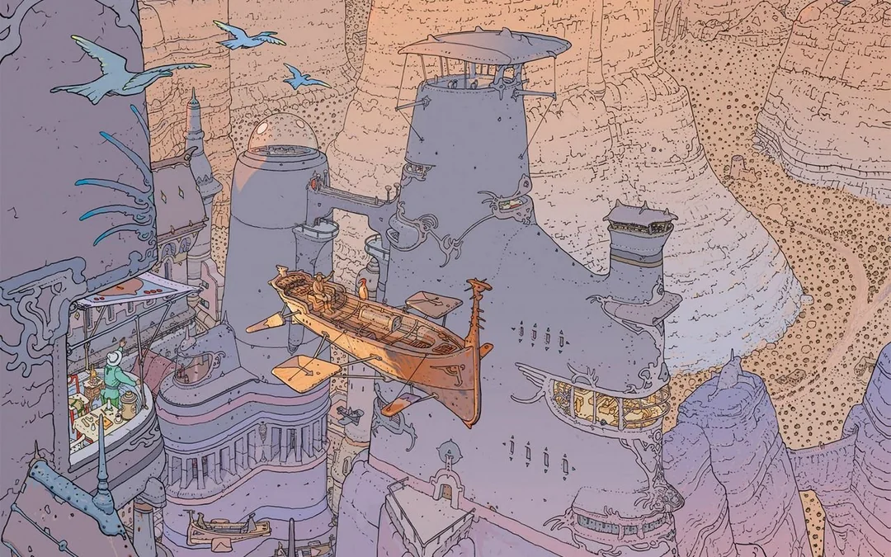

- **Sable (video game)**  
  A game directly inspired by Moebius' work, both visually and atmospherically.

    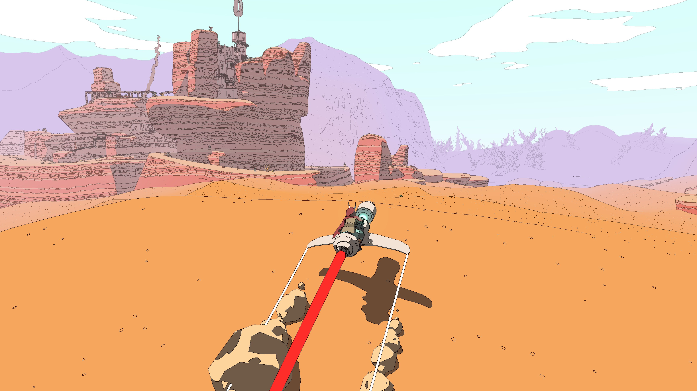

- **Edge detection for outlines**  
  Parts of the outline logic (depth / normal based edge detection) are adapted from this tutorial:  
  https://www.youtube.com/watch?v=nc3a3THBFrg

- **Initial inspiration for the NPR pipeline**  
  This video was the starting point for the project and influenced the overall approach, including the screen-space hatching shader:  
  https://www.youtube.com/watch?v=jlKNOirh66E

---

## Features

- Screen-space outlines based on:
    - Depth
    - Normals
    - Color / luminance differences
    - **Shadow step detection** —> detects light/shadow boundaries by comparing neighbor luminance against two configurable threshold pairs, covering both dark and light shadow zones
- Stable outlines on both opaque and transparent objects
- Screen-space hatching driven by pixel brightness
- **ColorGradient shader**  
  Allows defining a base color and a separate shadow color for opaque objects, enabling more interesting color gradients and flat-shaded looks
- **Skybox shader**  
  Defines a vertical color gradient for the sky and generates clouds using noise
- **Bubble shader**  
  Used to create transparent bubbles with specular highlights  
  (the same shader is also reused for water rendering)
- Modular Shader Graph setup with Custom Functions (HLSL) where needed

---

## Rendering Approach

- All main object shaders are **Unlit**
- Lighting and shadows are computed manually in shaders  
  (instead of relying on Unity's built-in lighting)
- This allows full artistic control and helps achieve a comic / flat color look
- Outlines and hatching are fullscreen post-processing shaders applied in screen space
- Render order: **Outlines** (before post-processing) then **Hatching** (after post-processing)  
  This ordering prevents the outline pass from detecting hatching stripes as false edges

---

## Time of Day

The project includes a **Time of Day system** designed to drive the overall mood of the scene.

Rather than aiming for physical realism, the system is used to:

- Change the global color tint of the scene
- Drive sky colors and atmosphere
- Create different ambiances depending on the time of day

Each phase (Dawn, Day, Dusk, Night) is defined as a **ScriptableObject profile** containing its own tint, sky colors, and sun angle. The controller interpolates between profiles on a circular 0..1 timeline.

A **Capture Override** mode bypasses the time of day entirely, exposing tint, sky colors, sun pitch and yaw directly in the Inspector for quick one-off screenshot setups.

---

## Capture Tool

A lightweight editor tool (`Tools > Game View Capture`) renders the scene at a configurable resolution and saves the result as a PNG.

- Works in both **Edit Mode** and **Play Mode**
- Shortcut: **Ctrl+Shift+C**

---

## Technical Notes

- Built with **Unity 6 URP**
- Shaders are implemented mostly in **Shader Graph**
- Some logic is implemented via **Custom HLSL Functions** when Shader Graph alone is not sufficient
- The project is intentionally experimental and not optimized for production

---

## Known Issues / Feedback Welcome

- Aliasing on outlines is still an issue
- The shadow step outline detection relies on absolute luminance thresholds and may need tuning per scene lighting
- Performance and shader complexity could be improved

**Any feedback, suggestions, or advice are welcome.**

---

## Assets & Credits

3D models are not made by me!

**Credits:**

- **Desert Houses** by [Gunnar Correa](https://sketchfab.com/gunnarcorrea)
- **Mountainous Desert** by [Šimon Ustal](https://sketchfab.com/simonustal)
- **Fortress Towers** by [Nicolai Kilstrup](https://sketchfab.com/nkilstrup)
- **Sand Rocks** and **Desert Stones** by [YadroGames](https://sketchfab.com/yadrogames)

---

## Visual Examples

<table>
  <tr>
    <td>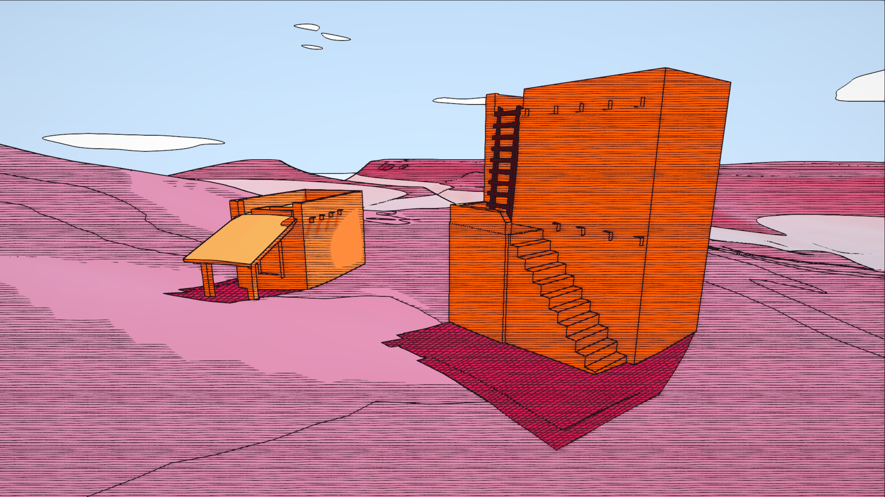</td>
    <td>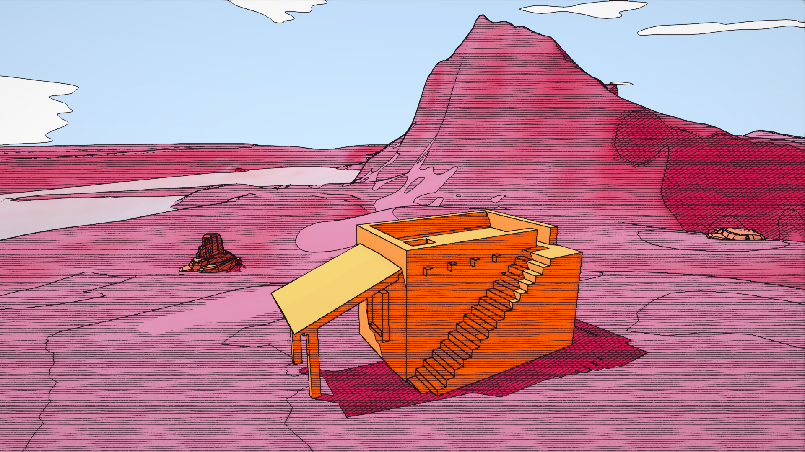</td>
  </tr>
  <tr>
    <td>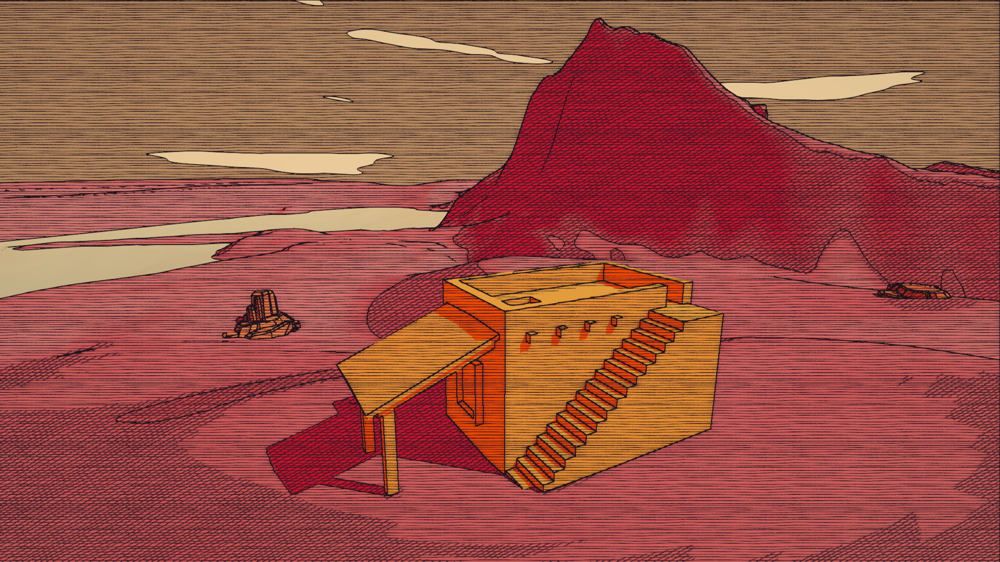</td>
    <td>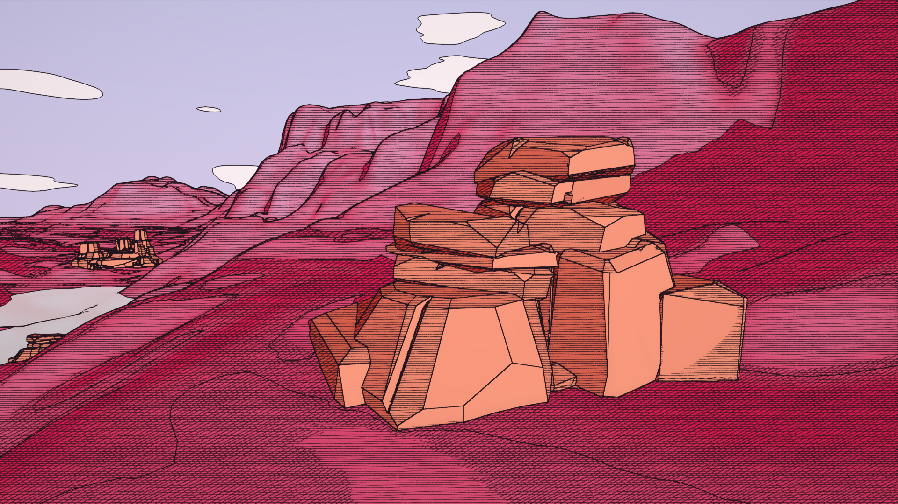</td>
  </tr>
  <tr>
    <td>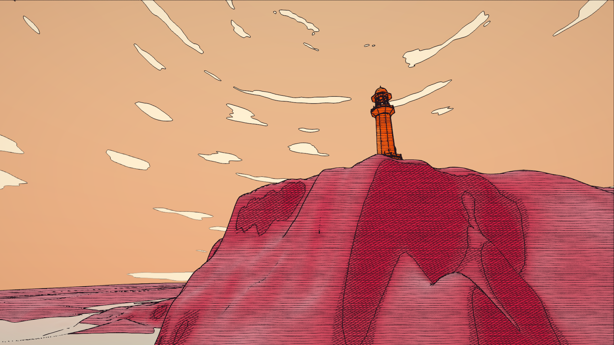</td>
    <td>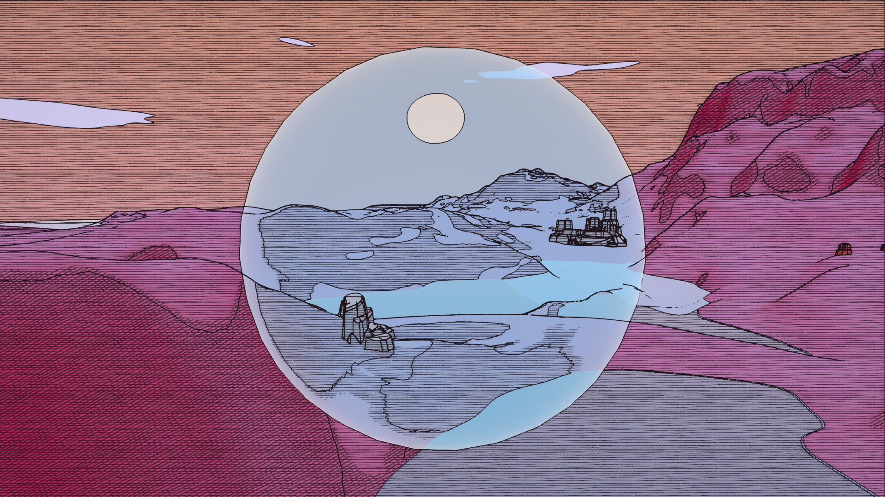</td>
  </tr>
  <tr>
    <td>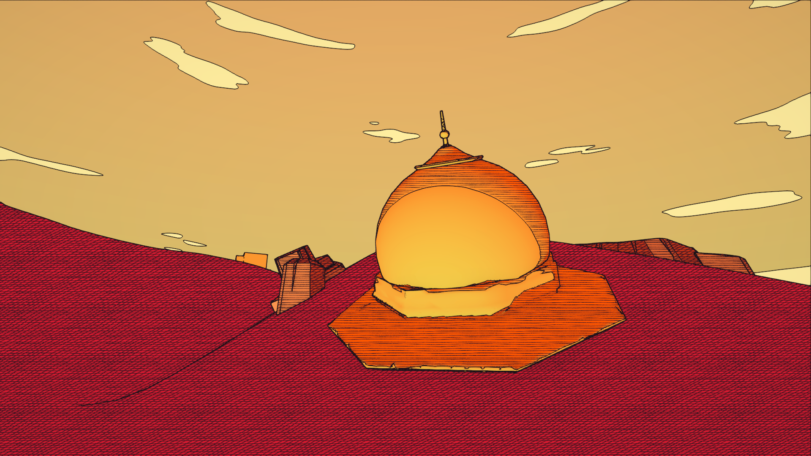</td>
    <td>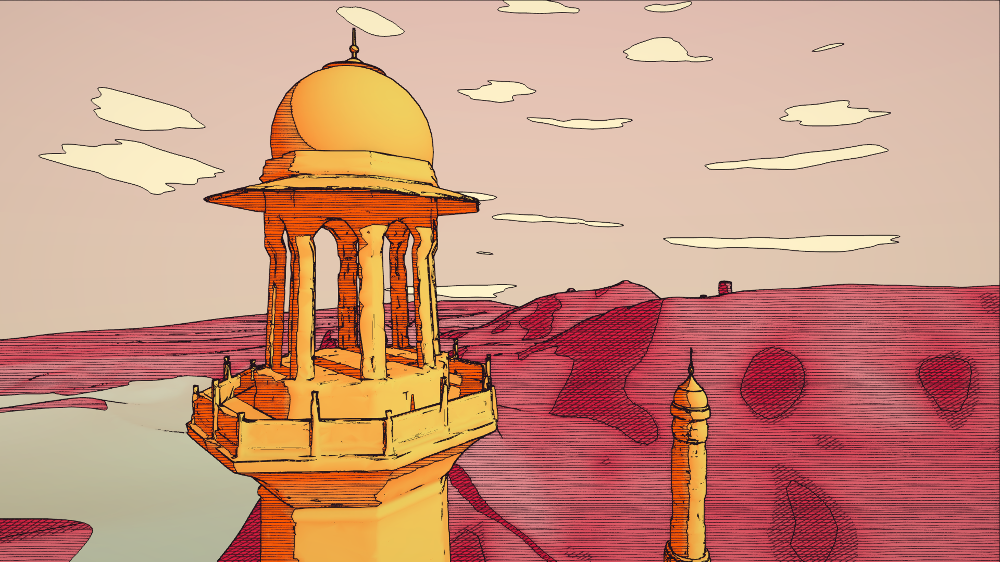</td>
  </tr>
  <tr>
    <td>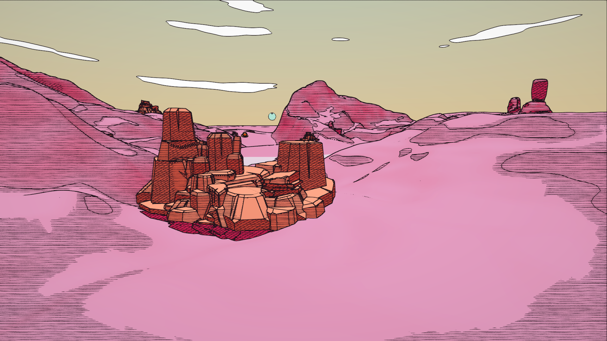</td>
    <td>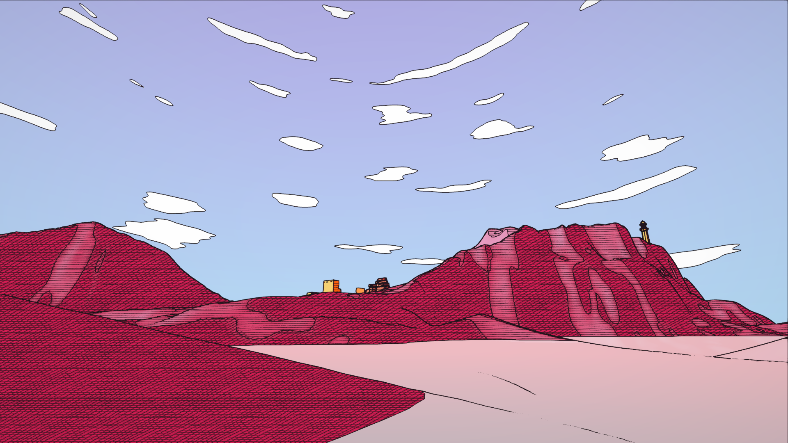</td>
  </tr>
</table>
